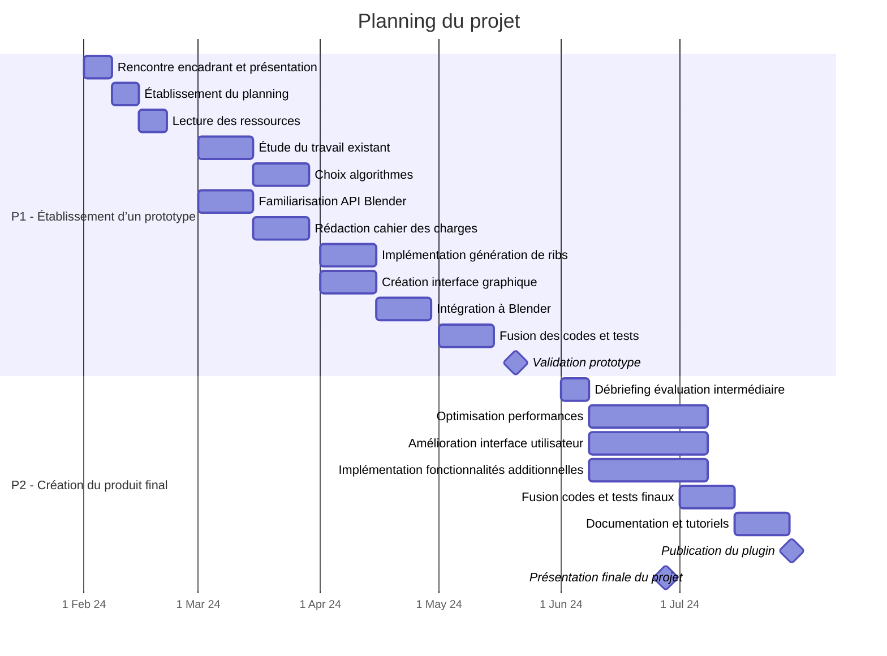

# Planning et répartition des tâches 

Pour plus d’efficacité, nous nous sommes répartis en deux groupes : 
- Groupe 1 : Alex + Alexis (Algorithmique) 
- Groupe 2 : Timothée + Dorian (Interface & Implémentation Blender) 

L’intérêt du projet est de produire un plugin Blender permettant à l’utilisateur de générer un modèle 3D simpliste à partir d’une image. Pour cela, l’utilisateur tracera 
une ligne directrice suivant la forme de l’objet (spine), et le plugin en déduira une forme géométrique représentative de l’objet (rib cage, composée de ribs), qui sera 
extrudée pour modéliser en 3D l’objet photographié.  

Dans un premier temps, l’objectif sera de réaliser un prototype fonctionnel avant l’évaluation intermédiaire (fin avril). Dans un second temps, l’objectif sera d’améliorer 
le prototype dans le but de le rendre plus rapide, robuste et ergonomique pour l’évaluation finale (fin juin). Le plugin final sera documenté et user-friendly afin de 
pouvoir être publié avant la fin de l’année scolaire. 

| Phase | Mois | Semaine | Tâches principales | Groupe |
|-------|------|---------|-------------------|--------|
| **P1 – Établissement d’un prototype** | **Février** | 1 | Rencontre avec l’encadrant et présentation des attentes du projet | 1 et 2 |
|  |  | 2 | Établissement du planning, répartition des tâches   Première lecture des ressources | 1 et 2 |
|  | **Mars** | 3 et 4 | Étude du travail existant (code et littérature)   Choix d’un algorithme de génération de ribs   → Détection des bords de l’objet   → « Distance function » pour champ de gradient pertinent   Choix d’un algorithme d’optimisation des ribs | 1 |
|  |  | 3 et 4 | Familiarisation avec l’API Blender   Recherche d’une bibliothèque permettant la réalisation d’une interface dynamique et adaptée | 2 |
|  |  | 3 et 4 | Rédaction d’un cahier des charges et des spécifications techniques | 1 et 2 |
|  |  | 5 et 6 | Implémentation du programme de génération de ribs et optimisation | 1 |
|  |  | 5 et 6 | Création de l’interface graphique (IHM) permettant de :   1) Tracer la ligne de spine    2) Modifier les ribs une fois générées   Intégration à Blender | 2 |
|  | **Avril** | 7 et 8 | Intégration des différentes fonctionnalités et fusion des codes   Sélection d’un jeu de données de test   Premiers tests et résolution de bugs | 1 et 2 |
|  |  | 9 | Derniers tests et validation du prototype   Séance d’évaluation intermédiaire | 1 et 2 |
| **P2 – Création du produit final publiable** | **Mai** | 10 | Débriefing de l’évaluation intermédiaire   Réévaluation du cahier des charges et des spécifications techniques | 1 et 2 |
|  |  | 11 à 13 | Optimisation des performances (rapidité et robustesse) | 1 |
|  |  | 11 à 13 | Amélioration de l’interface utilisateur (ergonomie) | 2 |
|  |  | 11 à 13 | Implémentation éventuelle de fonctionnalités additionnelles (à réfléchir avec l’encadrant en temps voulu…) | 1 et 2 |
|  | **Juin** | 14 et 15 | Intégration des différentes fonctionnalités et fusion des codes   Sélection d’un jeu de données de test complexe   Tests et résolution des bugs | 1 et 2 |
|  |  | 14 et 15 | Rédaction de la documentation et création de tutoriel d’utilisation pour utilisation par un tiers   Publication du plugin | 1 et 2 |
|  |  | **27 juin** | Présentation finale du projet | 1 et 2 |

Ce fichier a été généré par ChatGPT à partir du fichier [PLANNING.pdf](https://gitlab.telecom-paris.fr/proj104/2024-2025/3d-modeling/-/blob/main/PLANNING.pdf?ref_type=heads), qui a été rédigé à la main. Consulter [PLANNING.pdf](https://gitlab.telecom-paris.fr/proj104/2024-2025/3d-modeling/-/blob/main/PLANNING.pdf?ref_type=heads) pour une meilleur lisibilité.
